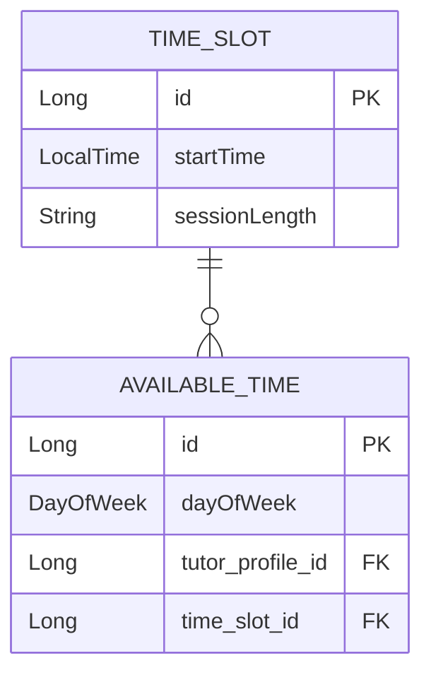

```mermaid
sequenceDiagram
    participant Client
    participant TutorController
    participant JwtService
    participant AvailableTimeComponentService
    participant TutorProfileService
    participant AvailableTimeService
    participant TutorProfileRepository
    Client ->> TutorController: POST /api/tutor/available-times/v1<br>Authorization + RequestBody
    TutorController ->> JwtService: extractUserId(token)
    JwtService -->> TutorController: userId
    TutorController ->> AvailableTimeComponentService: registerAvailableTimes(userId, requestList)
    AvailableTimeComponentService ->> TutorProfileService: getTutorProfileByUserId(userId)
    TutorProfileService ->> TutorProfileRepository: findByUserId(userId)
    TutorProfileRepository -->> TutorProfileService: TutorProfile
    TutorProfileService -->> AvailableTimeComponentService: TutorProfile
    AvailableTimeComponentService ->> AvailableTimeComponentService: createAvailableTimes(requests, tutorProfile)
    AvailableTimeComponentService ->> AvailableTimeService: saveAll(insertList)
    AvailableTimeService -->> AvailableTimeComponentService: 완료
    AvailableTimeComponentService -->> TutorController: 완료
    TutorController -->> Client: 201 Created
```

```mermaid
sequenceDiagram
    participant Client
    participant Controller
    participant JwtService
    participant ReservationComponentService
    participant StudentProfileService
    participant ReservationService
    Client ->> Controller: GET /reservation/v1<br>+ Authorization
    Controller ->> JwtService: extractUserId(token)
    JwtService -->> Controller: userId
    Controller ->> ReservationComponentService: getReservationByUserId(userId)
    ReservationComponentService ->> StudentProfileService: findByUserId(userId)
    StudentProfileService -->> ReservationComponentService: StudentProfile
    ReservationComponentService ->> ReservationService: findAllByStudentProfileId(profileId)
    ReservationService -->> ReservationComponentService: List<ReservationResponse>
    ReservationComponentService -->> Controller: 예약 목록
    Controller -->> Client: 200 OK + 예약 목록
```

# 지원자 홍석준 [링글-백엔드]

## ✅ 환경

Java 21, MySQL, Redis, Gradle<br>

## ✅ 실행 방법

- `/src/main/resources/application.yml` 에 Mysql, Redis 설정이 필요합니다.
  ```yaml
      #    url: jdbc:mysql://localhost:3306/ringletest?serverTimezone=Asia/Seoul&characterEncoding=UTF-8
    #    username: 'root'
    #    password: ''
        data:
          redis:
    #        host: localhost
    #        port: 6379
  ```
- `./gradlew clean build` <br>
- `./gradlew bootRun` <br>

## ✅ 실행 후 API 문서 URL(테스트 가능)

http://localhost:8080/swagger-ui/index.html

### Header - token: {id}

- `token 1` (Tutor), `token 2(`Student) 입니다.
- 구동 시 초기 데이터가 생성됩니다.

## ✅ 과제테스트 개요

- `CompoentService` : 여러 Service를 조합하여 하나의 유스케이스를 처리하는 역할을 수행 합니다.
- `DB I/O 최적화` :서비스 로직에서 반복 조회 대신, Bulk insert, JOIN, IN 등을 이용하여 DB 접근 횟수를 최소화했습니다.
- `Global Exception Handler` : 전역 예외 처리기를 통해 예외를 일관된 형식으로 핸들링하여, 예외 관리의 중복을 제거하고 했습니다.
- `Chacinag` : 현재 수업 가능한 시간대 응답을 Redis에 캐싱해 반복 계산을 줄이고 응답 속도를 향상시켰습니다.

## ✅ ERD 다이어그램

```mermaid
erDiagram
%% 엔티티 정의
    USER {
        Long id PK
        String email
        String name
    }

    TUTOR_PROFILE {
        Long id PK
        String bio
        Long user_id FK
    }

    STUDENT_PROFILE {
        Long id PK
        String preferences
        Long user_id FK
    }

    TIME_SLOT {
        Long id PK
        LocalTime startTime
        String sessionLength
    }

    AVAILABLE_TIME {
        Long id PK
        DayOfWeek dayOfWeek
        Long tutor_profile_id FK
        Long time_slot_id FK
    }

    RESERVATION {
        Long id PK
        LocalDate reservationDate
        Long available_time_id FK
        Long student_profile_id FK
    }

%% 관계 정의
    USER ||--|| TUTOR_PROFILE: ""
    USER ||--|| STUDENT_PROFILE: ""
    TUTOR_PROFILE ||--o{ AVAILABLE_TIME: ""
    TIME_SLOT ||--o{ AVAILABLE_TIME: ""
    AVAILABLE_TIME ||--o{ RESERVATION: ""
    STUDENT_PROFILE ||--o{ RESERVATION: ""

```



## ✅ 설계 배경: 예약 시간 관리

### 요구 사항 추가 : 튜터는 요일별로 수업 시간을 설정할 수 있다고 가정했습니다.

### `AvailableTime`은 요일과 시간 슬롯(자식)을 조합하여 튜터의 수업 가능 시간을 나타냅니다.



#### 시간 유연성과 데이터 정규화를 동시에 충족하기 위해 `TimeSlot`을 분리했습니다.

- `유연성 확보`: 현재는 30분 단위지만, 추후 15분·10분 등으로 변경 시에도 유연하게 대응하도록 TimeSlot을 별도 엔티티로 분리했습니다.
- `정규화 및 재사용`: 동일 시간 구간을 여러 튜터가 공유하므로 재사용성을 향상시켰습니다.

## ✅ 설계 배경: User 와 Profile 분리

```mermaid
erDiagram
%% 엔티티 정의
    USER {
        Long id PK
        String email
        String name
    }

    TUTOR_PROFILE {
        Long id PK
        String bio
        Long user_id FK
    }

    STUDENT_PROFILE {
        Long id PK
        String preferences
        Long user_id FK
    }
%% 관계 정의
    USER ||--|| TUTOR_PROFILE: ""
    USER ||--|| STUDENT_PROFILE: ""
```



#### `User`는 로그인·인증 등 공통 정보만 관리하고, 실제 역할별 행위는 `TutorProfile`, `StudentProfile`로 분리했습니다.

- 프로필이 존재해야 도메인 기능 접근 가능합니다.
- 역할별 도메인 클래스가 명확히 분리됩니다.
- 프로필별 필드가 자유롭게 확장 가능합니다.

## ✅ 수업 가능한 시간대 생성 & 삭제

#### 개요: 요일 마다 수업 가능한 시간대를 생성합니다.

```yaml
요청 JSON 예시:
  {
    "requestList": [
      { // 월요일 9:00 ~ 9:30, 10:00 ~ 10:30 수업 가능 시간대 생성
        "dayOfWeek": "MONDAY",
        "timmSlotCreateRequestList": [
          { "startTime": "09:00", "sessionLength": 30 },
          { "startTime": "10:00", "sessionLength": 30 }
        ]
      },
      { //수요일 14:00 ~ 15:00 수업 가능 시간대 생성
        "dayOfWeek": "WEDNESDAY",
        "timmSlotCreateRequestList": [
          { "startTime": "14:00", "sessionLength": 60 }
        ]
      }
    ]
  }
```

### 📍 jdbcTemplate을 이용하여 한번의 쿼리로 저장/삭제하였습니다.

```java
private final JdbcTemplate jdbcTemplate;

@Transactional
public void saveAll(List<AvailableTime> availableTimeList) {
	String sql = """
		INSERT INTO available_time (tutor_profile_id, time_slot_id, day_of_week, created_date, modified_date)
		VALUES (?, ?, ?, ?, ?)
		""";

	LocalDateTime now = LocalDateTime.now();

	jdbcTemplate.batchUpdate(sql, availableTimeList, availableTimeList.size(),
		(PreparedStatement ps, AvailableTime availableTime) -> {
			ps.setLong(1, availableTime.getTutorProfile().getId());
			ps.setLong(2, availableTime.getTimeSlot().getId());
			ps.setString(3, availableTime.getDayOfWeek().name());
			ps.setTimestamp(4, Timestamp.valueOf(now));
			ps.setTimestamp(5, Timestamp.valueOf(now));
		});

	{...}
}

```

### 📍생성 시퀀스 다이어그램



### 📍생성 시퀀스 다이어그램



```mermaid
sequenceDiagram
    participant Client
    participant TutorController
    participant JwtService
    participant AvailableTimeComponentService
    participant TutorProfileService
    participant AvailableTimeService
    participant AvailableTimeRepository
    participant TutorProfileRepository
    note right of Client 요청 JSON: {"availableTimeIds":[1,2,3]} end note
    Client ->> TutorController: DELETE /api/tutor/available-times/v1<br>Authorization + RequestBody
    TutorController ->> JwtService: extractUserId(token)
    JwtService -->> TutorController: userId
    TutorController ->> AvailableTimeComponentService: deleteAllByIds(userId, availableTimeIds)
    AvailableTimeComponentService ->> TutorProfileService: getTutorProfileByUserId(userId)
    TutorProfileService ->> TutorProfileRepository: findByUserId(userId)
    TutorProfileRepository -->> TutorProfileService: TutorProfile
    TutorProfileService -->> AvailableTimeComponentService: TutorProfile
    AvailableTimeComponentService ->> AvailableTimeService: findTutorIdByIdIn(availableTimeIds)
    AvailableTimeService ->> AvailableTimeRepository: findByIdIn(availableTimeIds)
    AvailableTimeRepository -->> AvailableTimeService: List<AvailableTime>
    AvailableTimeService -->> AvailableTimeComponentService: List<AvailableTime>
    AvailableTimeComponentService ->> AvailableTimeService: isOwner(tutorProfile, availableTimes)
    AvailableTimeService -->> AvailableTimeComponentService: true/false

    alt 소유자 확인 성공
        AvailableTimeComponentService ->> AvailableTimeService: deleteAllById(availableTimes)
        AvailableTimeService -->> AvailableTimeComponentService: 완료
    else 소유자 아님
        AvailableTimeComponentService -->> Client: 403 Forbidden (CustomException)
    end

    AvailableTimeComponentService -->> TutorController: 완료
    TutorController -->> Client: 204 No Content

```

## ✅ 기간 & 수업 길이로 현재 수업 가능한 시간대를 조회

#### 개요: 기간이 길어질 수록 리소스 사용량이 많아지기 때문에 캐싱을 적용했습니다.

### 📍시퀀스 다이어그램



```mermaid
sequenceDiagram
    participant Client
    participant Controller
    participant AvailableTimeComponentService
    participant ReservationService
    participant AvailableTimeService
    participant CacheService
    Client ->> Controller: GET /available-times/v1<br> + 쿼리 파라미터
    Controller ->> AvailableTimeComponentService: getAvailableTimes(startDate, endDate, sessionLength)
    AvailableTimeComponentService ->> ReservationService: 예약정보 조회
    AvailableTimeComponentService ->> AvailableTimeService: 기간 내 요일별 이용 가능한 시간 조회

    loop 날짜별 반복 (startDate ~ endDate)
        AvailableTimeComponentService ->> CacheService: 캐시 조회(cacheKey)
        alt 캐시 hit
            CacheService -->> AvailableTimeComponentService: 캐시된 응답
        else 캐시 miss
            AvailableTimeComponentService ->> AvailableTimeService: 예약 안 된 시간 필터링
            AvailableTimeComponentService ->> CacheService: 캐시 저장 (TTL:30)
        end
    end

    AvailableTimeComponentService -->> Controller: List<DailyAvailabilityResponse>
    Controller -->> Client: 200 OK + 응답 데이터
```

## ✅ 시간대 & 수업길이로 수업 가능한 튜터 조회

`기간 & 수업 길이로 현재 수업 가능한 시간대를 조회` 한 뒤 이어서 해당 API로 튜터를 조회할 경우, 캐싱으로 인해 반영이 늦어 <br>
`수업 가능한 튜터`가 조회되지 않는 문제가 발생할 수 있습니다. 이를 해결하기 위해 아래와 같은 흐름을 가정하였습니다.

- 사용자가 수업 가능한 튜터를 조회했지만 아무 튜터도 없는 경우

```
선택한 시간은 누군가 방금 예약했어요!
다른 시간을 선택해 주세요.
[다른 시간 보기]   [달력으로 돌아가기]
```

예약시 관련된 캐싱 데이터를 제거하기 때문에 돌아가서 다시 조회하게 되면 최신데이터를 전달받을 수 있습니다.

### 📍시퀀스 다이어그램



```mermaid
sequenceDiagram
    participant Client
    participant Controller
    participant TutorProfileService
    participant TutorProfileRepository
    Client ->> Controller: GET /v1?date=...&start=...&sessionLength=...
    Controller ->> TutorProfileService: getAvailableTutorProfile(date, start, sessionLength)
    TutorProfileService ->> TutorProfileRepository: findAvailableTutorsByDateAndTimeAndSessionLength(...)
    TutorProfileRepository -->> TutorProfileService: List<TutorProfile>
    TutorProfileService -->> Controller: List<TutorResponse>
    Controller -->> Client: 200 OK + Tutor 목록

```

## ✅ 시간대 & 수업길이로 튜터로 새로운 수업 신청

### 📍시퀀스 다이어그램



```mermaid
sequenceDiagram
    participant Client
    participant Controller
    participant JwtService
    participant ReservationService
    participant AvailableTimeService
    participant StudentProfileService
    participant ReservationRepository
    participant CacheService
    Client ->> Controller: POST /reservations/v1<br> Authorization + RequestBody
    Controller ->> JwtService: extractUserId(token)
    JwtService -->> Controller: userId
    Controller ->> ReservationService: createReservation(request, userId)
    ReservationService ->> AvailableTimeService: findByTutorIdAndSessionLengthAndDayOfWeek(...)
    AvailableTimeService -->> ReservationService: AvailableTime
    ReservationService ->> StudentProfileService: findByUserId(userId)
    StudentProfileService -->> ReservationService: StudentProfile
    ReservationService ->> ReservationRepository: save(reservation)
    ReservationRepository -->> ReservationService: 저장 완료
    ReservationService ->> CacheService: evict(cacheKey) ❌ 캐시 삭제
    CacheService -->> ReservationService: 완료
    ReservationService -->> Controller: 완료
    Controller -->> Client: 201 Created
```

## ✅ 신청한 수업 조회

### 📍시퀀스 다이어그램


